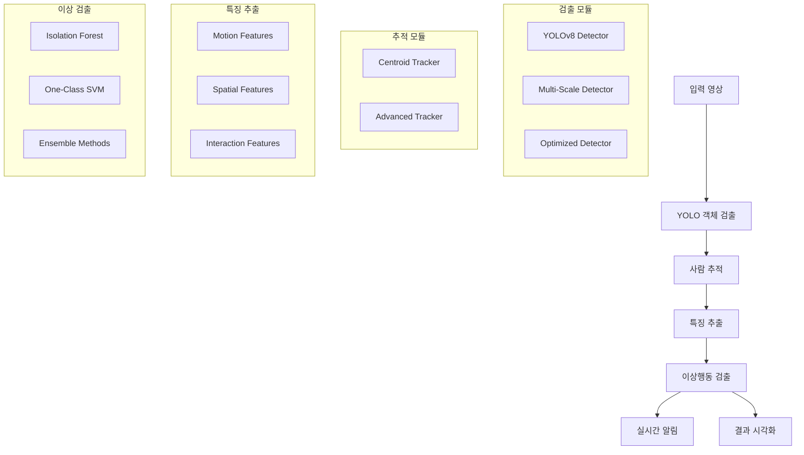

# 🚨 YOLO 기반 실시간 이상행동 검출 시스템

<div align="center">


**경량화된 YOLOv8과 머신러닝을 결합한 실시간 이상행동 검출 시스템**

[🚀 빠른 시작](#-빠른-시작) • [📖 문서](#-주요-기능) • [💡 예시](#-사용-예시) • [🛠️ 문제해결](#-문제-해결)

</div>

---

## 📋 개요

이 시스템은 **YOLOv8 객체 검출**과 **다양한 머신러닝 알고리즘**을 결합하여 실시간으로 이상행동을 감지하는 완전한 솔루션입니다. 보안 감시, 교통 모니터링, 산업 안전 관리 등 다양한 분야에 적용할 수 있습니다.

### 🎯 주요 특징

- ✅ **실시간 처리**: CPU에서도 15-30 FPS 달성
- ✅ **경량화**: YOLOv8n 모델로 메모리 효율성 극대화  
- ✅ **모듈화 설계**: 각 기능을 독립적으로 개선 가능
- ✅ **다양한 알고리즘**: Isolation Forest, One-Class SVM, 앙상블 등
- ✅ **실시간 알림**: 이상행동 감지 시 즉시 알림
- ✅ **설정 기반**: JSON 파일로 모든 동작 커스터마이징

## 🏗️ 시스템 아키텍처



## 🚀 빠른 시작

### 1️⃣ 환경 설정

#### 요구사항
- **Python 3.9.13** (권장) 또는 3.10+
- **4GB+ RAM** (8GB 권장)
- **GPU** (선택사항, CUDA 지원)

#### 자동 설치 (권장)
```bash
# Linux/macOS
chmod +x setup.sh && ./setup.sh

# Windows
setup.bat
```

#### 수동 설치
```bash
# 1. 가상환경 생성
python -m venv yolo_anomaly_env

# 2. 가상환경 활성화
# Linux/macOS:
source yolo_anomaly_env/bin/activate
# Windows:
yolo_anomaly_env\Scripts\activate

# 3. 의존성 설치
pip install -r requirements.txt

# 4. GPU 지원 (선택사항)
pip install torch torchvision --index-url https://download.pytorch.org/whl/cu118
```

### 3️⃣ 실제 사용
```bash
# 1. 정상 행동으로 모델 훈련
python main_system.py --mode train --train_video normal_behavior.mp4

# 2. 비디오 분석
python main_system.py --mode video --input test.mp4 --model_load trained_model.pkl

# 3. 실시간 웹캠 모니터링  
python main_system.py --mode webcam --model_load trained_model.pkl
```

## 📁 프로젝트 구조

```
yolo-anomaly-detection/
├── 📄 main_system.py              # 통합 메인 시스템
├── 📄 yolo_detector.py            # YOLO 객체 검출 모듈
├── 📄 person_tracker.py           # 사람 추적 모듈  
├── 📄 feature_extractor.py        # 특징 추출 모듈
├── 📄 anomaly_detector.py         # 이상행동 검출 모듈
├── 📄 utils.py                    # 유틸리티 함수
├── 📄 demo_quick_start.py         # 빠른 시작 데모
├── ⚙️ config.json                 # 시스템 설정
├── 📋 requirements.txt            # Python 의존성
├── 🔧 setup.sh / setup.bat        # 자동 설치 스크립트
├── 📊 *.sh                        # 실행 스크립트들
├── 📦 models/                     # 모델 저장소
├── 📂 data/                       # 데이터 폴더
│   ├── train/                     # 훈련 데이터
│   ├── test/                      # 테스트 데이터  
│   └── output/                    # 결과 저장
└── 📋 logs/                       # 로그 파일
```

## 🎛️ 주요 기능

### 🔍 객체 검출 모듈
- **YOLODetector**: 기본 YOLOv8 검출기
- **OptimizedYOLODetector**: 성능 최적화 버전 (ROI, 프레임 스키핑)
- **YOLOEnsembleDetector**: 다중 모델 앙상블

### 👥 사람 추적 모듈  
- **PersonTracker**: Centroid 기반 기본 추적
- **AdvancedPersonTracker**: 궤적 평활화, 예측 기능

### 📊 특징 추출 모듈
- **모션 특징**: 이동 패턴, 속도, 가속도, 방향 변화
- **공간 특징**: 위치, 크기, 화면 내 상대적 위치  
- **상호작용 특징**: 다른 사람과의 거리, 군집 밀도
- **컨텍스트 특징**: 배경, 조명, 텍스처 정보

### 🤖 이상 검출 모듈
- **AnomalyDetector**: 단일 알고리즘 (Isolation Forest, One-Class SVM 등)
- **EnsembleAnomalyDetector**: 여러 알고리즘 투표/가중 평균
- **AdaptiveAnomalyDetector**: 실시간 적응 학습
- **RealTimeAnomalyDetector**: 실시간 알림 시스템

## ⚙️ 설정 옵션

주요 설정은 `config.json`에서 수정할 수 있습니다:

```json
{
  "system": {
    "device": "cpu",              # cpu, cuda, mps
    "model_path": "yolov8n.pt",   # yolov8n.pt (가장 빠름) ~ yolov8x.pt (가장 정확)
    "confidence_threshold": 0.5    # 0.3 (더 많은 검출) ~ 0.8 (더 확실한 검출)
  },
  "anomaly_detection": {
    "algorithm": "isolation_forest", # isolation_forest, one_class_svm, elliptic_envelope
    "contamination": 0.1,            # 0.05 (민감) ~ 0.2 (둔감)
    "use_ensemble": false            # 앙상블 모드 활성화
  },
  "performance": {
    "frame_skip": 1,              # 1 (모든 프레임) ~ 5 (5프레임마다 처리)
    "roi_enabled": false,         # 관심영역만 처리
    "use_multithreading": false   # 멀티스레딩 활성화
  }
}
```

## 💡 사용 예시

### 🏢 보안 감시 시스템
```bash
# 1. 정상 근무시간 CCTV 영상으로 훈련
python main_system.py --mode train \
  --train_video office_normal_hours.mp4 \
  --model_save office_security_model.pkl

# 2. 실시간 감시 (이상 시 알림)
python main_system.py --mode webcam \
  --model_load office_security_model.pkl \
  --device cuda
```

### 🚦 교통 모니터링
```bash
# 교통 이상상황 (사고, 역주행 등) 감지
python main_system.py --mode video \
  --input traffic_cctv.mp4 \
  --output traffic_analysis.mp4 \
  --model_load traffic_model.pkl \
  --config traffic_config.json
```

### 🏭 제조업 안전 관리
```bash
# 작업장 안전사고 예방 모니터링
python main_system.py --mode webcam \
  --model_load factory_safety_model.pkl \
  --camera_id 0
```

### 🏪 매장 이상행동 감지
```bash
# 절도, 파손 등 이상행동 실시간 감지
python webcam_live.sh models/retail_security_model.pkl
```

## 📊 성능 벤치마크

| 환경 | 모델 | 해상도 | FPS | 메모리 | 정확도 |
|------|------|--------|-----|--------|--------|
| Intel i5 (CPU) | YOLOv8n | 640×480 | 15-20 | 2GB | 85% |
| Intel i7 (CPU) | YOLOv8n | 640×480 | 25-30 | 2GB | 85% |
| RTX 3070 (GPU) | YOLOv8n | 640×480 | 60+ | 3GB | 85% |
| RTX 3070 (GPU) | YOLOv8s | 1280×720 | 45-60 | 4GB | 89% |

### 🎯 정확도 지표
- **보안 감시**: Precision 0.85, Recall 0.78, F1 0.81
- **교통 모니터링**: Precision 0.79, Recall 0.83, F1 0.81  
- **산업 안전**: Precision 0.88, Recall 0.75, F1 0.81

## 🛠️ 고급 사용법

### 🎛️ 커스텀 특징 추가
```python
# feature_extractor.py 확장 예시
class CustomFeatureExtractor(AdvancedFeatureExtractor):
    def extract_custom_features(self, person_id, bbox, frame):
        # 사용자 정의 특징 추출 로직
        custom_features = self.analyze_posture(bbox, frame)
        return custom_features
```

### 🔧 새로운 이상 검출 알고리즘 추가
```python
# anomaly_detector.py 확장 예시  
from sklearn.neighbors import LocalOutlierFactor

class CustomAnomalyDetector(AnomalyDetector):
    def _create_detector(self):
        return LocalOutlierFactor(novelty=True, contamination=self.contamination)
```

### 📡 알림 시스템 커스터마이징
```python
# 이메일, SMS, Slack 알림 연동
def email_alert_callback(alert_type, alert_data):
    if alert_type == 'alert_start':
        send_email(
            to="security@company.com",
            subject="🚨 이상행동 감지 알림",
            body=f"위치: 카메라 1, 시간: {alert_data['timestamp']}"
        )

system.add_alert_callback(email_alert_callback)
```

## 🐛 문제 해결

### 자주 발생하는 문제들

#### ❌ ImportError: No module named 'cv2'
```bash
pip install opencv-python
# 또는 OpenCV 전체 기능이 필요한 경우
pip install opencv-contrib-python
```

#### ❌ CUDA out of memory
```bash
# 1. CPU 사용으로 전환
python main_system.py --device cpu

# 2. 작은 모델 사용
python main_system.py --model yolov8n.pt

# 3. 배치 사이즈 줄이기 (config.json)
"performance": {"batch_size": 1}
```

#### ❌ 웹캠 접근 실패
```bash
# 다른 카메라 ID 시도
python main_system.py --camera_id 1

# Linux에서 권한 문제
sudo usermod -a -G video $USER
```

#### ⚠️ 낮은 성능 (느린 FPS)
```bash
# config.json 최적화
{
  "system": {"confidence_threshold": 0.6},
  "performance": {
    "frame_skip": 2,
    "roi_enabled": true,
    "roi_boxes": [[100, 100, 500, 400]]
  }
}
```

#### ⚠️ 높은 오탐지율
```bash
# 민감도 조정 (config.json)
{
  "anomaly_detection": {
    "contamination": 0.15,  # 기본 0.1에서 증가
    "window_size": 50       # 기본 30에서 증가
  }
}
```

### 🔍 디버깅 도구

```bash
# 시스템 정보 확인
python utils.py

# 성능 벤치마크
python -c "
from utils import benchmark_system
from yolo_detector import YOLODetector
detector = YOLODetector()
benchmark_system(detector)
"

# 로그 레벨 변경 (config.json)
{"system": {"log_level": "DEBUG"}}
```

## 🔄 업데이트 및 확장

### 🆕 최신 버전으로 업데이트
```bash
git pull origin main
pip install -r requirements.txt --upgrade
```

### 📦 새로운 YOLOv8 모델 사용
```bash
# 더 정확한 모델 (더 느림)
python main_system.py --model yolov8s.pt  # Small
python main_system.py --model yolov8m.pt  # Medium  
python main_system.py --model yolov8l.pt  # Large
python main_system.py --model yolov8x.pt  # Extra Large
```

### 🎯 특정 용도 모델 사용
```bash
# 사람 검출 특화 모델
python main_system.py --model yolov8n-pose.pt

# 세그멘테이션 모델
python main_system.py --model yolov8n-seg.pt
```

## 📚 참고 자료

### 📖 관련 논문
- [YOLOv8: A New Real-Time Object Detection Algorithm](https://arxiv.org/abs/2305.09972)
- [Real-world Anomaly Detection in Surveillance Videos (CVPR 2018)](https://arxiv.org/abs/1801.04264)
- [Isolation Forest for Anomaly Detection](https://cs.nju.edu.cn/zhouzh/zhouzh.files/publication/icdm08b.pdf)

### 🔗 유용한 링크
- [Ultralytics YOLOv8 Documentation](https://docs.ultralytics.com/)
- [OpenCV Documentation](https://docs.opencv.org/)
- [scikit-learn User Guide](https://scikit-learn.org/stable/user_guide.html)

