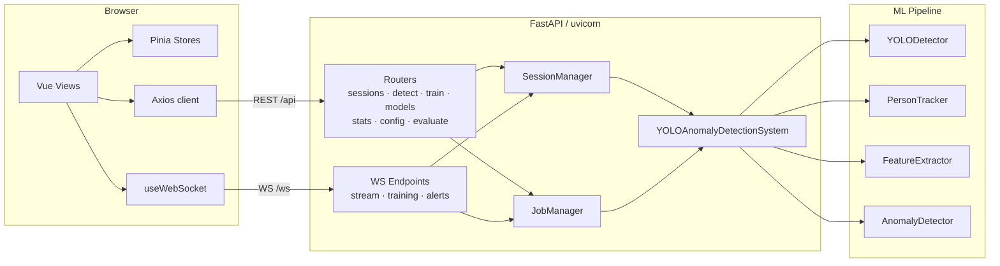
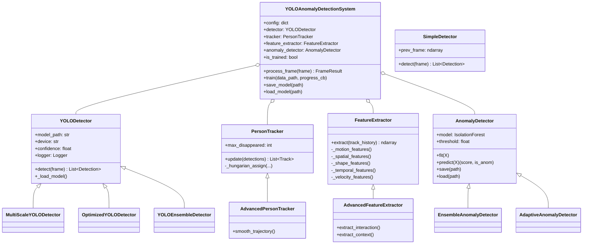
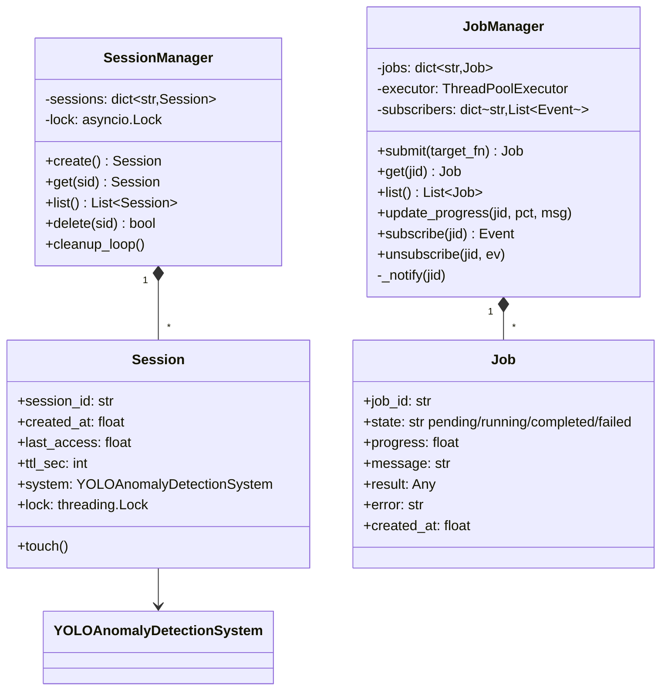
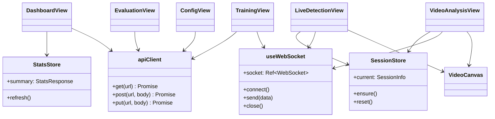
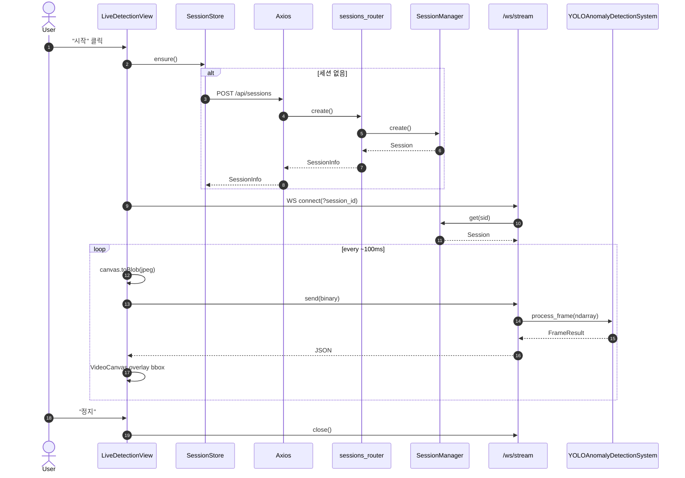
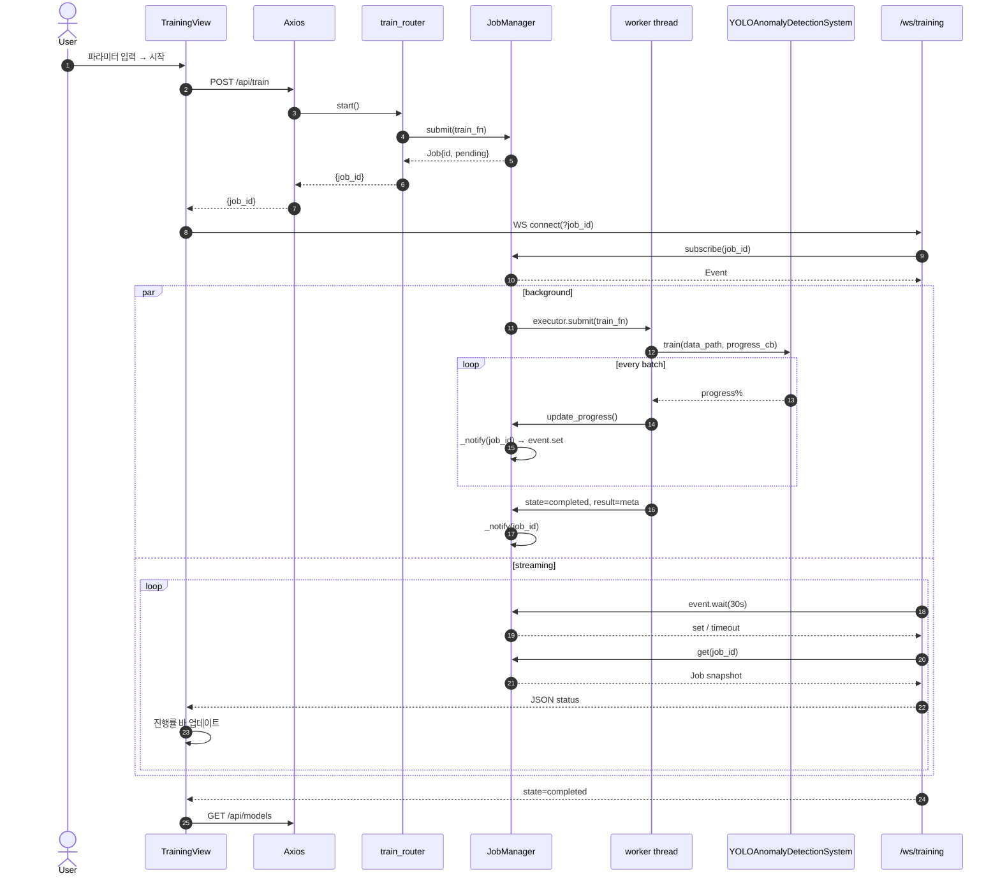
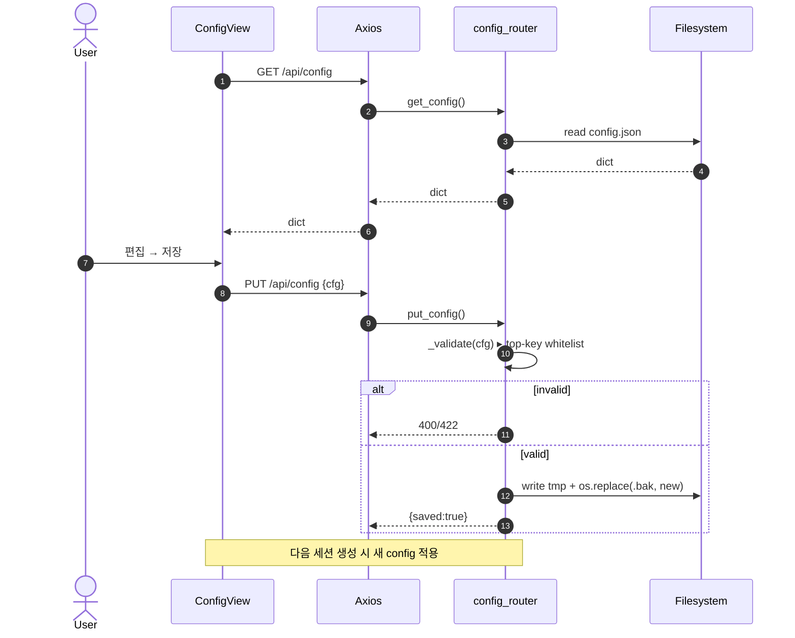
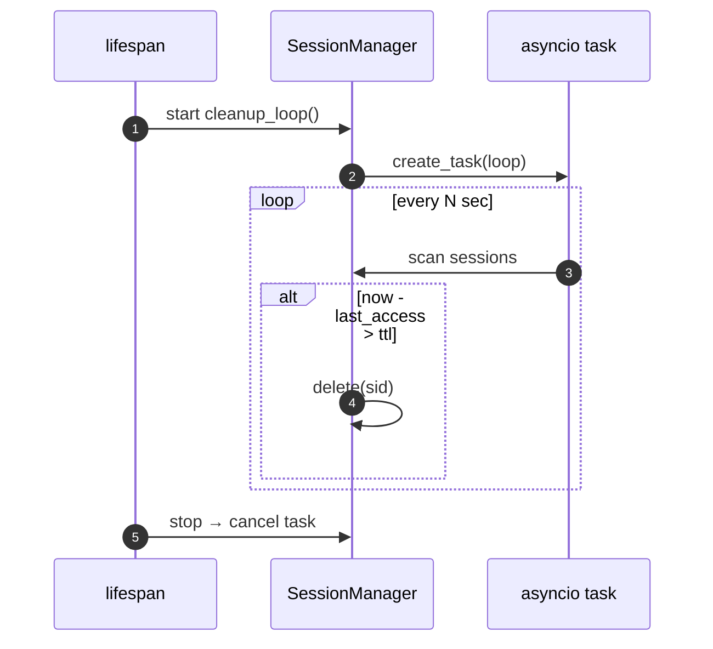
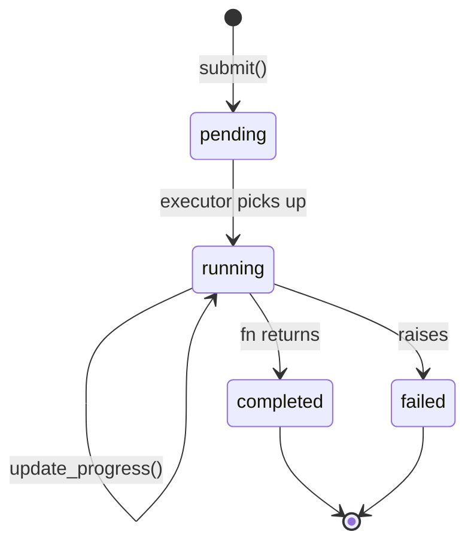
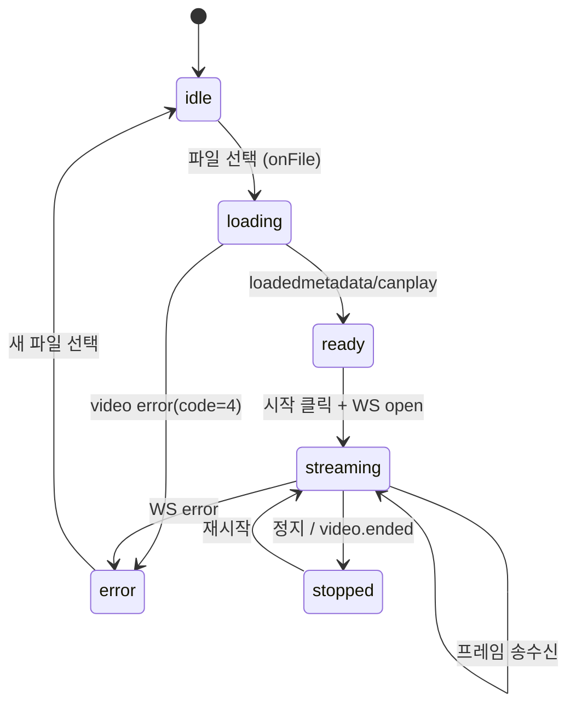

# UML Diagrams

프로젝트의 주요 구조와 상호작용을 Mermaid 로 표현한 UML 문서입니다. GitHub/IntelliJ/대부분의 Markdown 뷰어에서 바로 렌더링됩니다.

## 1. Component Diagram (전체 구성)

## 2. Backend Class Diagram

## 3. Service Layer Class Diagram

## 4. Frontend Class/Module Diagram

## 5. Sequence Diagram — Live Frame Streaming

## 6. Sequence Diagram — Training Job

## 7. Sequence Diagram — Config Edit with Hot-Reload

## 8. Sequence Diagram — Session TTL Cleanup

## 9. State Diagram — Job Lifecycle

## 10. State Diagram — Video Analysis UI

